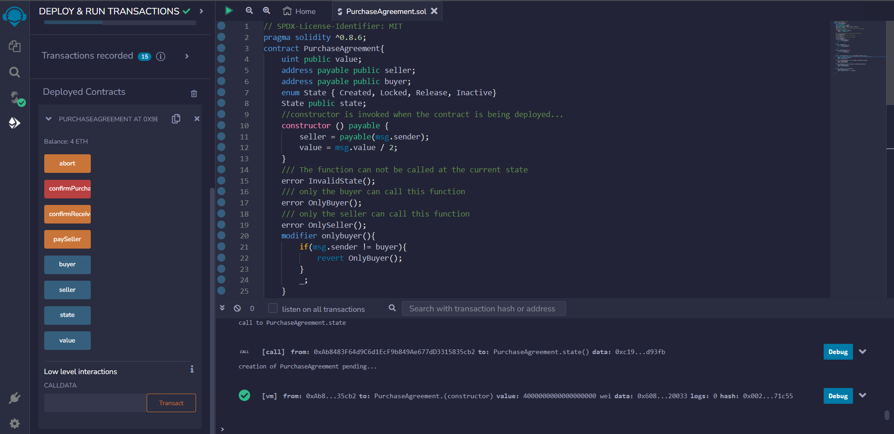

# buying-and-selling-smart-contract
This project illustrates how you can build and run a secure contract for buying and selling of a commodity without any intermediaries
## Requirements
IDE - Visual Studio Code with Remix Extension or use Remix IDE
Node.js
## Language used
Solidity
## output after deployment

## How to run the project
1.Compile the project
2.Select the address for the seller, set value (price ) and deploy.
3.After deployment, change the address to that of the buyer, the enter the value( same as one set by the seller) and then  Confirm Purchase (transact).
4.Confirm received.
5.Then switch the address to that of the seller and call the paySeller function

